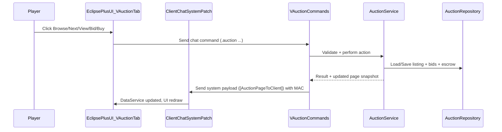

# VAuction (root folder) — Super-Detailed Implementation Plan

## Goals

- **Create a standalone server mod** under [`VAuction/`](VAuction/) with:
  - Auction listings, bidding, buy-now, cancellation, expiry, resolution, escrow/claims
  - Configurable economy (currency, fees, limits, anti-snipe)
  - Persistence across restarts with safe file IO + retention
- **Add a top-level VAuction Character Menu tab in EclipsePlus (client)** that:
  - Browses/paginates listings by category
  - Shows listing details
  - Sends bid/buy/cancel/claim actions via chat commands
  - Receives listing data via the existing **MAC-verified system chat payload** pipeline (same one used by Bloodcraft)

## Non-Goals (Phase 1)

- Cross-server auctions
- Blind/Dutch auctions (kept as “Phase 2+” extensions)
- Familiar auctions (kept as “Phase 2/3” – planned in detail but not shipped in Phase 1)

## Key repo constraints (must-follow)

- **No parallel UI ownership**: we will extend existing character menu injection patterns; no separate ad-hoc injection loops.
- **Il2Cpp constraints**:
  - Don’t use `new RectOffset(l,r,t,b)` (use default + assign)
  - Use `UnityEngine.Object.Destroy()` explicitly
  - Avoid Unity EventSystems pointer handler interfaces
  - Non-interactive TMP text: `raycastTarget = false` and ensure alpha is visible
- **Network payload size**: server-to-client system chat uses `FixedString512Bytes` (`Server/Bloodcraft/Services/LocalizationService.cs`), so **auction sync must be page-based and compact**.

## High-level architecture

### Server-side (VAuction)

- **Command layer** (`VAuction/Commands/*`): validates input + calls services
- **Domain layer** (`VAuction/Domain/*`): pure models + invariants
- **Persistence layer** (`VAuction/Persistence/*`): repositories + atomic JSON storage + migrations
- **Services** (`VAuction/Services/*`): auction logic, escrow, pricing/fees, notifications
- **Systems** (`VAuction/Systems/*`): periodic expiration/resolution tick
- **EclipsePlus sync** (`VAuction/EclipseBridge/*`): builds compact payloads and sends to client with MAC

### Client-side (EclipsePlus)

- **Transport**: extend existing MAC-verified pipeline:
  - Server sends: `[{eventId}]:<payload>;mac<...>`
  - Client consumes in `Patches/ClientChatSystemPatch.cs` and routes by `NetworkEventSubType`
- **State**: store auction UI data in `Services/DataService.cs` (single source of truth)
- **UI**: add a new top-level injected tab `VAuction` (not a Bloodcraft sub-tab)

### Data flow (mermaid)



## Folder & file layout

### New: [`VAuction/`](VAuction/) (server mod project)

```
VAuction/
├── VAuction.csproj
├── thunderstore.toml
├── Plugin.cs
├── Core.cs
│
├── Config/
│   └── VAuctionConfigService.cs
│
├── Domain/
│   ├── AuctionId.cs
│   ├── AuctionListing.cs
│   ├── AuctionItem.cs
│   ├── AuctionBid.cs
│   ├── AuctionStatus.cs
│   ├── AuctionCategory.cs
│   ├── CurrencyDefinition.cs
│   └── ValidationErrors.cs
│
├── Persistence/
│   ├── JsonStore.cs
│   ├── AuctionRepository.cs
│   ├── EscrowRepository.cs
│   ├── SchemaVersion.cs
│   └── Migrations/
│       └── Migration_0001_Initial.cs
│
├── Services/
│   ├── AuctionService.cs
│   ├── BiddingService.cs
│   ├── PricingService.cs
│   ├── EscrowService.cs
│   ├── NotificationService.cs
│   ├── InventoryService.cs
│   └── PermissionsService.cs
│
├── Systems/
│   └── AuctionTimerSystem.cs
│
├── Commands/
│   ├── AuctionCommands.cs
│   └── AuctionAdminCommands.cs
│
└── EclipseBridge/
    ├── EclipseAuctionPayloads.cs
    ├── EclipseAuctionSender.cs
    ├── MacSigner.cs
    └── Protocol.md
```

### Existing client files to modify (EclipsePlus)

- Transport + routing:
  - [`Patches/ClientChatSystemPatch.cs`](Patches/ClientChatSystemPatch.cs)
- Client-side state:
  - [`Services/DataService.cs`](Services/DataService.cs)
- New top-level tab injection + lifecycle:
  - [`Patches/InitializationPatches.cs`](Patches/InitializationPatches.cs) (call `VAuctionMenuService.TryInitialize`)
  - [`Services/CanvasService.cs`](Services/CanvasService.cs) (call `VAuctionMenuService.Update`)
  - Add new service:
    - [`Services/VAuctionMenuService.cs`](Services/VAuctionMenuService.cs)
- Shared UI building helpers (reuse):
  - [`Services/CharacterMenu/Shared/UIFactory.cs`](Services/CharacterMenu/Shared/UIFactory.cs)
- Assets/localization (if adding strings/icons):
  - [`Resources/Localization/English.json`](Resources/Localization/English.json)
  - [`Services/HUD/Shared/HudData.cs`](Services/HUD/Shared/HudData.cs) (only if new sprites are required)

## Protocol design (server ↔ client)

### Event IDs

Extend `NetworkEventSubType` on both sides (client: `Patches/ClientChatSystemPatch.cs`; server: `VAuction/EclipseBridge/EclipseAuctionPayloads.cs`), continuing from existing values:

- `8  AuctionPageToClient`
- `9  AuctionDetailToClient`
- `10 AuctionMyListingsToClient`
- `11 AuctionMyBidsToClient`
- `12 AuctionEscrowToClient`
- `13 AuctionNotificationToClient`

### Payload constraints

- **Max 512 bytes** after adding `;mac...`
- Therefore:
  - Server sends **one page at a time** (e.g., 8–12 listings)
  - Listing fields are compact (integers + short IDs)
  - Detail view is separate payload

### Payload formats (compact, CSV-with-segments)

All payloads follow:

- `[{eventId}]:<payloadBody>;mac<base64-hmac>`

#### `AuctionPageToClient` body

- Header: `v1,<category>,<page>,<pageCount>,<total>,<serverTimeUtcUnix>`
- Then `|`-separated listings (each listing is comma-separated):
  - `<auctionKey>,<type>,<cat>,<nameKey>,<prefab>,<qty>,<curBid>,<buyNow>,<cur>,<expiresUnix>,<flags>`

Notes:

- `auctionKey`: short stable key (see `AuctionId` below)
- `nameKey`: either prefab localization key or short display name (trimmed)
- `flags`: bitfield: featured, hasBids, sellerIsMe, bidderIsMe, etc.

#### `AuctionDetailToClient` body

- `v1,<auctionKey>,<sellerName>,<itemName>,<prefab>,<qty>,<startBid>,<curBid>,<buyNow>,<currencyPrefab>,<expiresUnix>,<status>,<minNextBid>,<yourMaxBid>`
- Optional bid history truncated to N entries as `|bidder,amount,unix`

#### `AuctionNotificationToClient` body

- `v1,<kind>,<auctionKey>,<amount>,<currencyPrefab>,<text>`

### AuctionId strategy

- Implement `Domain/AuctionId.cs` as a wrapper over a `ulong` created from:
  - `(unixSeconds << 16) | random16`
- Encode to base36 for short `auctionKey` (8–11 chars typical).
- Persist as `ulong` in JSON, send as base36 string.

## Server-side details (VAuction)

### `Plugin.cs` + `Core.cs`

- Follow Bloodcraft server plugin pattern (`Server/Bloodcraft/Plugin.cs`):
  - Only load when `Application.productName == "VRisingServer"`
  - `Harmony.CreateAndPatchAll`
  - Config init (`VAuctionConfigService.InitializeConfig()`)
  - Data load (`AuctionRepository.LoadAll()` + `EscrowRepository.LoadAll()`)
  - `CommandRegistry.RegisterAll()`
  - Start timer system (`AuctionTimerSystem.Start()`)

### Config (`Config/VAuctionConfigService.cs`)

- Mirror Bloodcraft’s config style (section ordering, default value headers, organized config file).

Sections & keys (Phase 1):

- **General**
  - `Enabled` (bool)
  - `MaxListingsPerPlayer` (int)
  - `MinAuctionDurationHours` / `MaxAuctionDurationHours` (int)
  - `HistoryRetentionDays` (int)
- **Economy**
  - `PrimaryCurrencyPrefab` (int)
  - `ListingFeePercent` (int)
  - `SaleTaxPercent` (int)
  - `CancelRefundPercent` (int)
  - `MinimumPrice` / `MaximumPrice` (int)
- **Bidding**
  - `MinBidIncrementPercent` (int)
  - `AntiSnipeWindowMinutes` (int)
  - `AntiSnipeExtensionMinutes` (int)
- **UI**
  - `EnableEclipseSync` (bool)
  - `PageSize` (int)

### Domain models

- `AuctionListing`
  - `AuctionId Id`
  - `ulong SellerSteamId`
  - `string SellerName`
  - `AuctionItem Item`
  - `AuctionCategory Category`
  - `long CreatedUnix`
  - `long ExpiresUnix`
  - `AuctionStatus Status`
  - `int StartingBid`
  - `int CurrentBid`
  - `ulong? HighestBidderSteamId`
  - `string? HighestBidderName`
  - `int CurrencyPrefabGuid`
  - `List<AuctionBid> BidHistory` (capped for storage and UI)
  - Derived helpers: `HasBids`, `IsExpired(now)`, `MinNextBid(config)`

- `AuctionItem`
  - `int PrefabGuid`
  - `int Quantity`
  - `string DisplayName` (server-side resolved once for UX)
  - Later extension hooks: `SerializedItemProperties` for equipment rolls (Phase 2)

### Persistence

- `Persistence/JsonStore.cs`
  - Atomic write: write to temp file, fsync, rename
  - Backups: keep last N backups
- `AuctionRepository`
  - `ActiveListings` dictionary keyed by `AuctionId`
  - `HistoryListings` list with retention pruning
- `EscrowRepository`
  - `Dictionary<ulongSteamId, List<EscrowEntry>>`
  - `EscrowEntry` contains either item prefab+qty (Phase 1) and later familiar payload

### Services

- `InventoryService`
  - Wrap `InventoryUtilities` and `ServerGameManager.TryRemoveInventoryItem/TryAddInventoryItem`
  - Provide helpers:
    - `TryTakeCurrency(inventoryEntity, currencyPrefab, amount)`
    - `TryGiveCurrency(inventoryEntity, currencyPrefab, amount)`
    - `TryTakeItem(inventoryEntity, prefab, qty)`
    - `TryGiveItem(inventoryEntity, prefab, qty)`
  - Listing source rules (Phase 1):
    - `.auction sellweapon ...` sells currently equipped weapon (`Equipment.WeaponSlot` like `WeaponManager.GetCurrentWeaponType` usage)
    - `.auction sellitem <prefabGuid> <qty> ...` sells an inventory item explicitly
    - Keep `.auction sell` as an alias to `.auction sellweapon` to match your original plan text, but document that “cursor item” is not reliably available server-side.

- `PricingService`
  - Computes listing fee, sale tax, cancel refund
  - Clamps prices to min/max

- `BiddingService`
  - Validates:
    - Not seller, active listing, not expired
    - `amount >= minNextBid`
    - Currency available
  - Applies anti-snipe:
    - If `expires - now <= window`, extend by `extension`

- `EscrowService`
  - On sale/expiry:
    - Move item to winner escrow OR return to seller
  - `.auction claim`:
    - Transfers escrow entries to player inventory (best effort, partial failures reported)

- `AuctionService`
  - Creates listings, resolves sales, handles expiry
  - Owns the single lock for in-memory state changes

- `NotificationService`
  - Sends: outbid/won/sold/expired notifications
  - Uses EclipseBridge payloads when enabled

### Systems

- `AuctionTimerSystem`
  - Coroutine loop (pattern like Bloodcraft’s background routines) that:
    - Every N seconds: scan active listings for expiry
    - Resolve expired auctions
    - Persist deltas

### Commands (VCF)

- `[CommandGroup(name: "auction", "auc")]`

Player commands (Phase 1):

- `.auction browse [category] [page]`
- `.auction view <auctionKey>`
- `.auction bid <auctionKey> <amount>`
- `.auction buy <auctionKey>`
- `.auction my [page]`
- `.auction bids [page]`
- `.auction claim`
- `.auction cancel <auctionKey>`
- `.auction sellweapon <startBid> <buyNow> <hours>`
- `.auction sellitem <prefabGuid> <qty> <startBid> <buyNow> <hours>`

Admin commands:

- `.auction admin remove <auctionKey>`
- `.auction admin clearExpired`
- `.auction admin pause|resume`
- `.auction admin stats`

Implementation rule: for every command, send a structured Eclipse payload to keep the UI in sync.

## Client-side UI (EclipsePlus) — top-level VAuction tab

### Injection & lifecycle

We will add a new service `Services/VAuctionMenuService.cs` that mirrors the safe parts of `Services/CharacterMenuService.cs`:

- `TryInitialize(InventorySubMenu menu)`
  - Clone an existing tab button (template: `AttributesTabButton`) to create `VAuctionTabButton`
  - Clone an existing tab root (template: last tab) to create `VAuctionTab`
  - Build content using `UIFactory` (no custom EventSystems handlers)

- `Update()`
  - If active, render from `DataService` auction state

- Wiring:
  - `Patches/InitializationPatches.cs`: call `VAuctionMenuService.TryInitialize(menu)`
  - `Services/CanvasService.cs`: call `VAuctionMenuService.Update()` alongside `CharacterMenuService.Update()`
  - `Patches/InitializationPatches.cs` destroy hook: call `VAuctionMenuService.Reset()`

### UI structure

Inside `VAuctionTab`:

- Header row: title `VAuction`
- Category buttons: `All`, `Weapons`, `Armor`, `Resources` (Phase 1)
- Paging controls: `Prev`, `Next`, `Page X/Y`
- Listing list (N rows): each row shows:
  - Item name
  - Qty
  - Current bid / buy-now
  - Time left
  - Buttons: `View` (opens detail panel)
- Detail panel (hidden until View):
  - Full listing info
  - `Bid +` buttons (quick increments) and `Bid` action
  - `Buy Now` action

Critical UI rules from lessons:

- Hide icons if sprite lookup fails (no placeholders)
- Divider must participate in layout
- TMP text raycast disabled unless it’s the button label

### Client-side state additions (`Services/DataService.cs`)

Add a new section of cached state:

- `AuctionPageState` (current category, page, pageCount, lastUpdatedUnix)
- `List<AuctionListingSummaryDto>`
- `AuctionListingDetailDto? SelectedListing`
- `int EscrowCount`
- `string LastError`

### Client transport changes

- Extend `ClientChatSystemPatch.NetworkEventSubType` to include new VAuction event IDs.
- Extend `HandleServerMessage` switch:
  - Route `AuctionPageToClient` → `DataService.ParseAuctionPageData(payload)`
  - Route `AuctionDetailToClient` → `DataService.ParseAuctionDetailData(payload)`
  - etc.

## Phase plan (deliverables)

### Phase 1 (your selected scope): Server + UI

- VAuction server plugin created, with item/resource auctions and full lifecycle.
- EclipsePlus VAuction top-level tab implemented.
- Protocol implemented: page + detail payloads.

### Phase 2: Equipment rolls + richer categories

- Serialize/restore item stats where possible (within game constraints).
- Add filters: “Has buy-now”, “Ending soon”, “No bids”.

### Phase 3: Familiar auctions (BloodCraftPlus integration)

- Add `AuctionItemType.Familiar`
- Implement safe familiar serialization/transfer with slot-based identity (mirrors lessons about slot-based actions).

## Verification checklist (what we’ll run later when implementing)

- Server: create listing → bid → outbid → buy now → claim → restart server → data persists
- Expiry: create short auction → wait → resolve → escrow
- UI: open VAuction tab → browse pages → view detail → bid/buy → state updates without chat spam